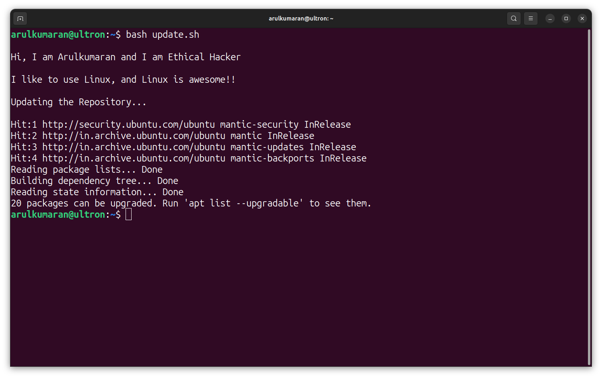
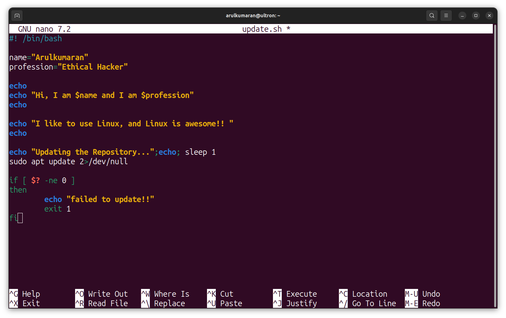

# Bash

  

 

<h1>Bash Programming</h1>
<ul>
  <li> Bash scripting is used to automate repetitive tasks and streamline complex processes on Unix-like operating systems.</li>
  <li>Bash scripts are essential for system administrators to manage configurations, perform backups, and carry out routine maintenance tasks in a command-line environment.</li>
</ul>

 

<h2>SheBang!!</h2>
<h3 align='center'>#! /bin/bash</h3>

The shebang line in a Bash script specifies the path to the Bash interpreter.

The shebang <b>(#! /bin/bash)</b> at the beginning tells the system to interpret the script using the Bash shell. The second line is a comment, and it's optional but good practice for clarity.

<h3>Bash Script</h3>

Utilize the default script editor (nano) in your Linux distribution, as per my suggestion. 

<h4 align='center'>Bash Program to Update the Local Repositories</h4>

  

simple, bash script to update the local repositories in linux distribution

<h4 align='center'>output</h4>

  

